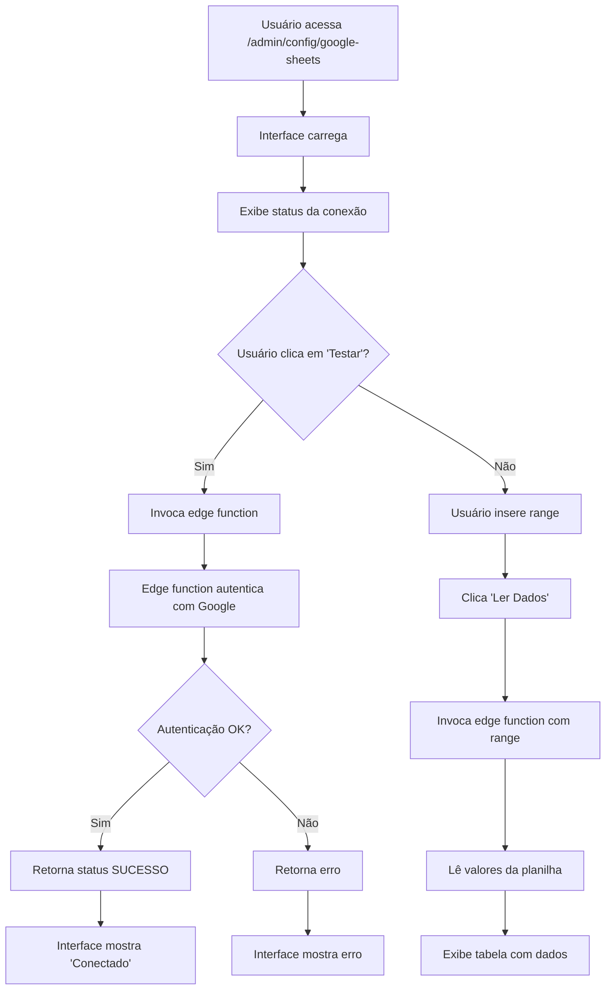

## Integração com Google Sheets - Apenas Leitura + Interface de Teste

### Resumo Executivo
Criar uma integração de **leitura** com Google Sheets que permite consultar dados da planilha sem modificá-los. Incluirá uma interface de administração para testar e gerenciar a conexão com feedback visual em tempo real.

### Arquivos a Criar

#### 1. Edge Function (`supabase/functions/google-sheets/index.ts`)
A função será responsável por:
- Ler os secrets `CREDENCIAL_GOOGLE` (JSON da service account) e `CHAVE_GOOGLE_SHEET_TABELA_BOARD` (ID da planilha)
- Gerar um JWT assinado com RSA usando a chave privada da service account
- Trocar o JWT por um access token na API OAuth do Google
- Fazer chamadas apenas de **leitura** à Google Sheets API v4
- Suportar dois parâmetros na requisição:
  - `action: "read"` — lê dados de um range específico
  - `range: "Sheet1!A1:Z100"` — define qual parte da planilha ler

**Fluxo de autenticação**:
```
1. Parse service account JSON (email, private_key)
2. Create JWT claim (iss, scope, aud, exp)
3. Sign JWT with RSA private key (Web Crypto API do Deno)
4. POST jwt para https://oauth2.googleapis.com/token
5. Recebe access_token
6. Use token para GET https://sheets.googleapis.com/v4/spreadsheets/{id}/values/{range}
```

#### 2. Nova Página Admin (`src/pages/admin/GoogleSheetsConfig.tsx`)
Interface de administração com:
- **Seção 1: Status da Conexão**
  - Exibe se a conexão está ativa (verde/vermelho)
  - Mostra última data de sincronização
  - Botão "Testar Conexão" que valida a autenticação

- **Seção 2: Gerenciador de Ranges**
  - Campo de entrada para especificar o range (ex: "Sheet1!A1:Z100")
  - Preview dos dados lidos (tabela)
  - Botão para copiar dados para clipboard
  - Histórico de últimas 5 leituras com timestamp

- **Seção 3: Logs & Debug**
  - Exibe últimas 10 tentativas (sucesso/erro)
  - Mostra mensagens de erro da API Google

#### 3. Atualizar Config de Rotas (`src/App.tsx`)
- Adicionar rota `/admin/config/google-sheets` apontando para a nova página

#### 4. Atualizar Sidebar (`src/components/layout/AppSidebar.tsx`)
- Adicionar item "Google Sheets" no menu Admin > Cadastros
- Usar ícone Sheet/Table
- Executar apenas para usuários com permissão `admin_cadastros`

#### 5. Atualizar config.toml (`supabase/config.toml`)
```toml
[functions.google-sheets]
verify_jwt = false
```

### Secrets a Adicionar
1. **CREDENCIAL_GOOGLE** — JSON completo da service account
2. **CHAVE_GOOGLE_SHEET_TABELA_BOARD** — ID da planilha

**Nota importante**: Como a chave privada foi compartilhada, recomenda-se rotacioná-la na Google Cloud Console após configuração.

### Fluxo de Implementação



### Detalhes Técnicos

**Autenticação JWT (RS256)**:
- Header: `{"alg": "RS256", "typ": "JWT"}`
- Payload: 
  ```json
  {
    "iss": "email@projeto.iam.gserviceaccount.com",
    "scope": "https://www.googleapis.com/auth/spreadsheets.readonly",
    "aud": "https://oauth2.googleapis.com/token",
    "exp": now + 3600,
    "iat": now
  }
  ```
- Signature: assinado com private key da service account

**Endpoints Google usados**:
- `POST https://oauth2.googleapis.com/token` — obter access token
- `GET https://sheets.googleapis.com/v4/spreadsheets/{id}/values/{range}` — ler dados

**Tratamento de erros**:
- Credenciais inválidas → status 401
- Sheet não encontrado → status 404
- Range inválido → status 400
- Timeout → retry com backoff

### Próximo Passo

Após implementação, será possível:
1. Validar a conexão com a planilha
2. Consultar dados de qualquer range
3. Usar esses dados em outras funcionalidades (importar clientes, sincronizar preços, etc.)

